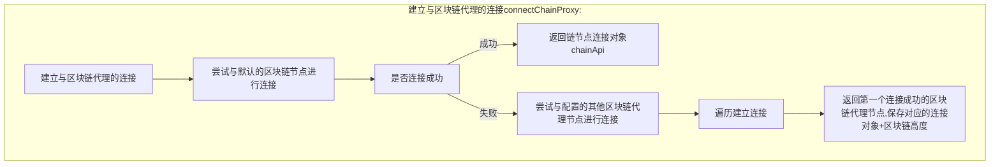
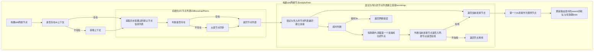

```mermaid
graph TD
subgraph 建立与区块链代理的连接connectChainProxy:
建立与区块链代理的连接--> 尝试与默认的区块链节点进行连接 --> 是否连接成功
是否连接成功 -- 成功 -->返回链节点连接对象chainApi
是否连接成功 -- 失败 --> 尝试与配置的其他区块链代理节点进行连接 --> 遍历建立连接
遍历建立连接 --> 返回第一个连接成功的区块链代理节点,保存对应的连接对象+区块链高度
end
```

```mermaid
graph TD
subgraph 构建ipfs网络节点initIpfsPeer:
构建ipfs网络节点 --> 是否存在dc上下文
是否存在dc上下文 -- 不存在 --> 获取上下文 --> 获取历史配置过的默认节点信息列表
是否存在dc上下文 -- 存在 --> 获取历史配置过的默认节点信息列表

subgraph 初始化DC节点列表initBoostrapPeers:
获取历史配置过的默认节点信息列表 --> 判断是否存在
判断是否存在 -- 不存在 --> 从链节点同步 --> 返回节点列表
判断是否存在 -- 存在 --> 返回节点列表
end

返回节点列表 --> 尝试与传入的节点列表遍历建立连接
subgraph 尝试与传入的节点列表建立连接bootstrap:
尝试与传入的节点列表遍历建立连接 --> 超时判断
超时判断 --> 有效期内,获取第一个连接成功的节点 --> 判断当前连接节点是否入网,即节点是否在线
判断当前连接节点是否入网,即节点是否在线 -- 在线 --> 返回当前连接节点
判断当前连接节点是否入网,即节点是否在线 -- 不在线 -->返回节点离线
超时判断 -- 超时3s --> 返回网络错误
end

尝试与传入的节点列表遍历建立连接 --> 返回当前连接节点 --> 第一个dc连接作为服务节点 --> 更新路由表中的peerid的地址,与有效期todo
end
```
// todo

```mermaid
graph TD
subgraph 开启定时验证token线程:
开启定时验证token线程--> token验证任务是否已经开启 
token验证任务是否已经开启 --> 已经开启,结束
token验证任务是否已经开启 --> 未开启 --> 启动30s一次心跳维持连接
启动30s一次心跳维持连接 --> 每次心跳都进行判断
每次心跳都进行判断 --> 需要结束线程,结束
每次心跳都进行判断 --> 不需要结束线程,心跳count+1 --> 判断是否已经存在DC节点对象
判断是否已经存在DC节点对象 --> 不存在,结束
判断是否已经存在DC节点对象 --> 存在,刷新业务接入节点的token --> 判断DC节点对象是否连接
判断DC节点对象是否连接 --> 没有连接 --> 连接DC节点
连接DC节点 --> 连接成功 --> 验证token 
连接DC节点 --> 连接失败,结束
判断DC节点对象是否连接 --> 已经连接 --> 验证token
验证token --> 返回错误invalid-token --> 重新刷新token --> 继续,刷新备份了账号信息节点连接的token
验证token --> 返回其他错误 --> 重新连接DC节点
重新连接DC节点 --> 连接成功,获取token --> 继续,刷新备份了账号信息节点连接的token
重新连接DC节点 --> 重新连接失败,结束

继续,刷新备份了账号信息节点连接的token --> 账号备份节点对象是否存在
账号备份节点对象是否存在 --> 不存在,与账号备份信息节点间建立连接 --> 刷新账号备份节点token
账号备份节点对象是否存在 --> 存在 --> 刷新账号备份节点token
刷新账号备份节点token --> 验证账号备份节点token
验证账号备份节点token --> 失败 --> 刷新账号备份节点token
刷新账号备份节点token --> 失败,需要重新选一个备份了账号信息的节点进行接入
刷新账号备份节点token --> 成功 --> 继续,获取当前区块高度
验证账号备份节点token --> 成功 --> 继续,获取当前区块高度
继续,获取当前区块高度 --> 获取当前区块高度,保存dc对象里
end
```