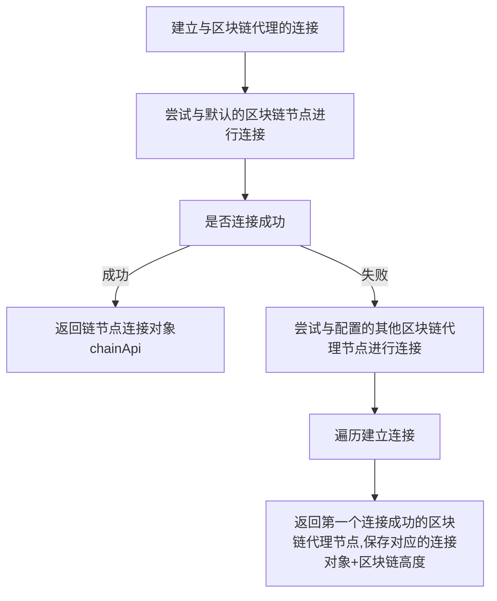
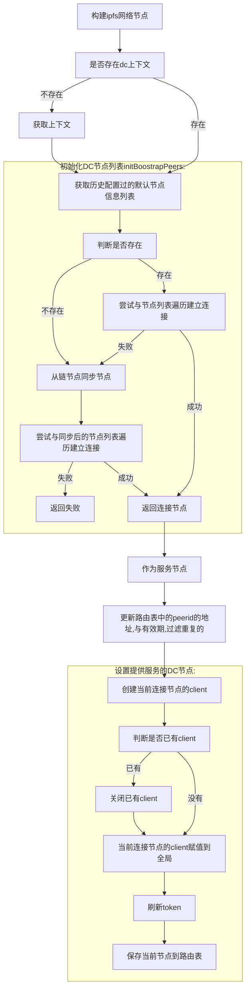
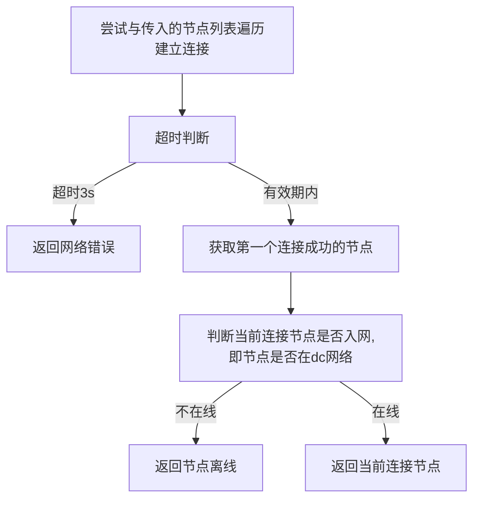
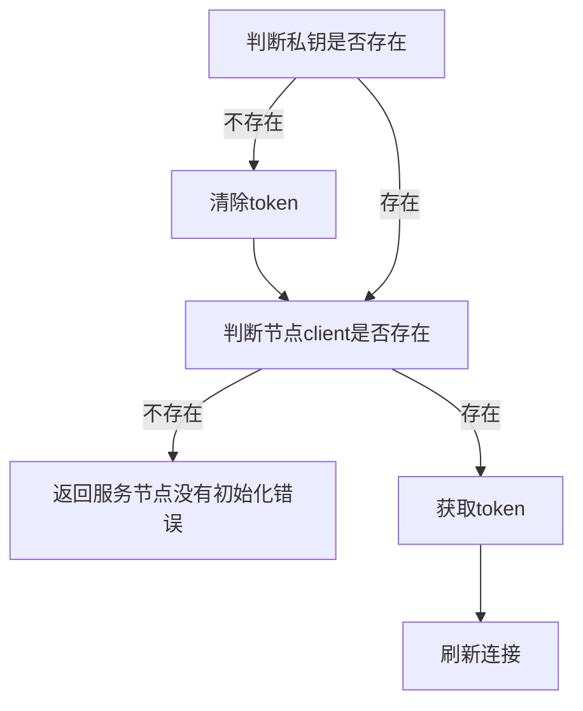
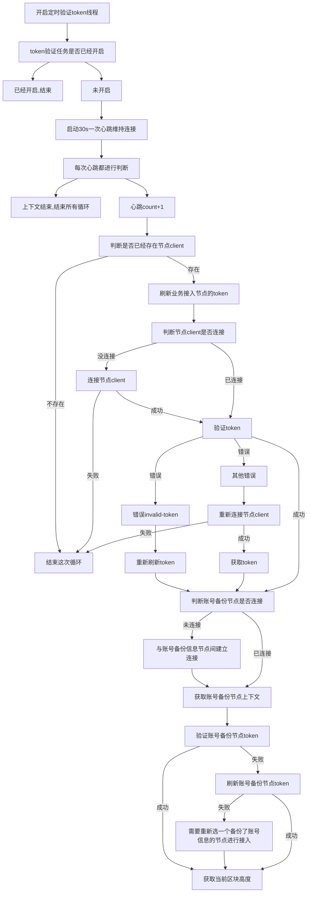

#### 建立与区块链代理的连接connectChainProxy

```mermaid
graph TD
建立与区块链代理的连接--> 尝试与默认的区块链节点进行连接 --> 是否连接成功
是否连接成功 -- 成功 -->返回链节点连接对象chainApi
是否连接成功 -- 失败 --> 尝试与配置的其他区块链代理节点进行连接 --> 遍历建立连接
遍历建立连接 --> 返回第一个连接成功的区块链代理节点,保存对应的连接对象+区块链高度
```

#### 构建ipfs网络节点initIpfsPeer

```mermaid
graph TD
构建ipfs网络节点 --> 是否存在dc上下文
是否存在dc上下文 -- 不存在 --> 获取上下文 --> 获取历史配置过的默认节点信息列表
是否存在dc上下文 -- 存在 --> 获取历史配置过的默认节点信息列表

subgraph 初始化DC节点列表initBoostrapPeers:
获取历史配置过的默认节点信息列表 --> 判断是否存在
判断是否存在 -- 不存在 --> 从链节点同步节点
判断是否存在 -- 存在 --> 尝试与节点列表遍历建立连接
尝试与节点列表遍历建立连接 -- 失败 --> 从链节点同步节点
从链节点同步节点 --> 尝试与同步后的节点列表遍历建立连接
尝试与节点列表遍历建立连接 -- 成功 --> 返回连接节点
尝试与同步后的节点列表遍历建立连接 -- 失败 --> 返回失败
尝试与同步后的节点列表遍历建立连接 -- 成功 --> 返回连接节点
end

返回连接节点 --> 作为服务节点 --> 更新路由表中的peerid的地址,与有效期,过滤重复的 --> 创建当前连接节点的client


subgraph 设置提供服务的DC节点:
创建当前连接节点的client --> 判断是否已有client
判断是否已有client -- 已有 --> 关闭已有client --> 当前连接节点的client赋值到全局
判断是否已有client -- 没有 --> 当前连接节点的client赋值到全局 --> 刷新token --> 保存当前节点到路由表
end

```

#### 尝试与传入的节点列表建立连接bootstrap

```mermaid
graph TD
尝试与传入的节点列表遍历建立连接 --> 超时判断
超时判断 -- 超时3s --> 返回网络错误
超时判断 -- 有效期内 --> 获取第一个连接成功的节点 --> 判断当前连接节点是否入网,即节点是否在dc网络
判断当前连接节点是否入网,即节点是否在dc网络 -- 不在线 -->返回节点离线  
判断当前连接节点是否入网,即节点是否在dc网络 -- 在线 --> 返回当前连接节点
```

#### 刷新token

```mermaid
graph TD
判断私钥是否存在 -- 不存在 --> 清除token --> 判断节点client是否存在
判断私钥是否存在 -- 存在 --> 判断节点client是否存在
判断节点client是否存在 -- 不存在 --> 返回服务节点没有初始化错误
判断节点client是否存在 -- 存在 --> 获取token --> 刷新连接
```

#### 开启定时验证token线程

```mermaid
graph TD
开启定时验证token线程--> token验证任务是否已经开启 
token验证任务是否已经开启 --> 已经开启,结束
token验证任务是否已经开启 --> 未开启 --> 启动30s一次心跳维持连接 --> 每次心跳都进行判断
每次心跳都进行判断 --> 上下文结束,结束所有循环
每次心跳都进行判断 --> 心跳count+1 --> 判断是否已经存在节点client
判断是否已经存在节点client -- 不存在 --> 结束这次循环
判断是否已经存在节点client -- 存在 --> 刷新业务接入节点的token --> 判断节点client是否连接
判断节点client是否连接 -- 没连接 --> 连接节点client
连接节点client -- 成功 --> 验证token 
连接节点client -- 失败 --> 结束这次循环
判断节点client是否连接 -- 已连接 --> 验证token
验证token -- 错误 --> 错误invalid-token --> 重新刷新token --> 判断账号备份节点是否连接
验证token -- 错误 --> 其他错误 --> 重新连接节点client
重新连接节点client -- 成功 --> 获取token --> 判断账号备份节点是否连接
重新连接节点client -- 失败 --> 结束这次循环
验证token -- 成功 --> 判断账号备份节点是否连接
判断账号备份节点是否连接 -- 未连接 --> 与账号备份信息节点间建立连接 --> 获取账号备份节点上下文
判断账号备份节点是否连接 -- 已连接 --> 获取账号备份节点上下文
获取账号备份节点上下文 --> 验证账号备份节点token
验证账号备份节点token -- 成功 --> 获取当前区块高度
验证账号备份节点token -- 失败 --> 刷新账号备份节点token
刷新账号备份节点token -- 失败 --> 需要重新选一个备份了账号信息的节点进行接入 --> 获取当前区块高度
刷新账号备份节点token -- 成功 --> 获取当前区块高度
```

// 删除过期数据
// 启动数据库空间监控,当数据库空间不足时，自动分配20M
