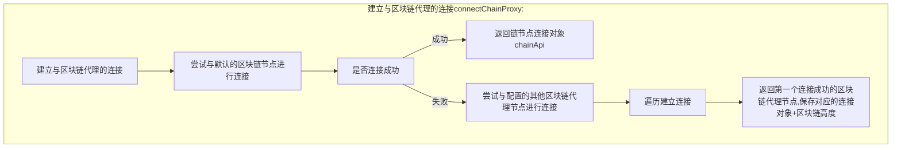
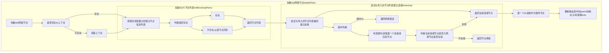

```mermaid
graph TD
subgraph 建立与区块链代理的连接connectChainProxy:
建立与区块链代理的连接--> 尝试与默认的区块链节点进行连接 --> 是否连接成功
是否连接成功 -- 成功 -->返回链节点连接对象chainApi
是否连接成功 -- 失败 --> 尝试与配置的其他区块链代理节点进行连接 --> 遍历建立连接
遍历建立连接 --> 返回第一个连接成功的区块链代理节点,保存对应的连接对象+区块链高度
end
```

```mermaid
graph TD
subgraph 构建ipfs网络节点initIpfsPeer:
构建ipfs网络节点 --> 是否存在dc上下文
是否存在dc上下文 -- 不存在 --> 获取上下文 --> 获取历史配置过的默认节点信息列表
是否存在dc上下文 -- 存在 --> 获取历史配置过的默认节点信息列表

subgraph 初始化DC节点列表initBoostrapPeers:
获取历史配置过的默认节点信息列表 --> 判断是否存在
判断是否存在 --> 不存在,从链节点同步 --> 返回节点列表
判断是否存在 --> 存在 --> 返回节点列表
end

返回节点列表 --> 尝试与传入的节点列表遍历建立连接
subgraph 尝试与传入的节点列表建立连接bootstrap:
尝试与传入的节点列表遍历建立连接 --> 超时判断
超时判断 --> 有效期内,获取第一个连接成功的节点 --> 判断当前连接节点是否入网,即节点是否在线
判断当前连接节点是否入网,即节点是否在线 -- 在线 --> 返回当前连接节点
判断当前连接节点是否入网,即节点是否在线 -- 不在线 -->返回节点离线
超时判断 -- 超时3s --> 返回网络错误
end

尝试与传入的节点列表遍历建立连接 --> 返回当前连接节点 --> 第一个dc连接作为服务节点 --> 更新路由表中的peerid的地址,与有效期todo
end
```
