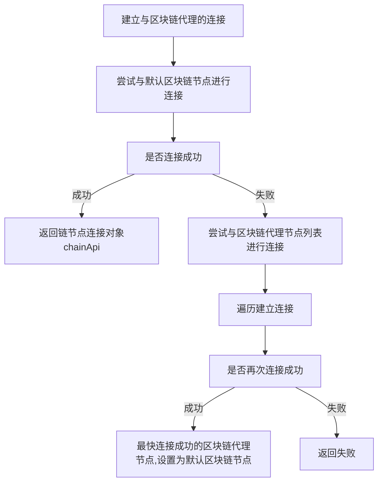
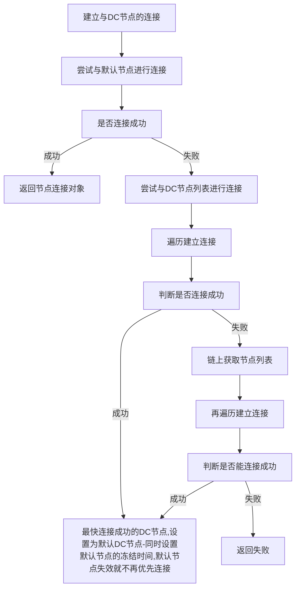
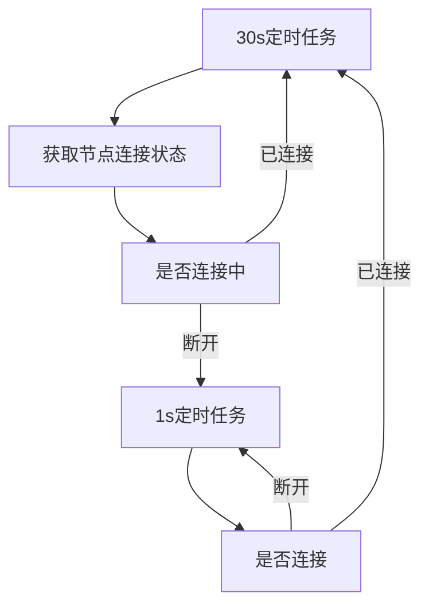
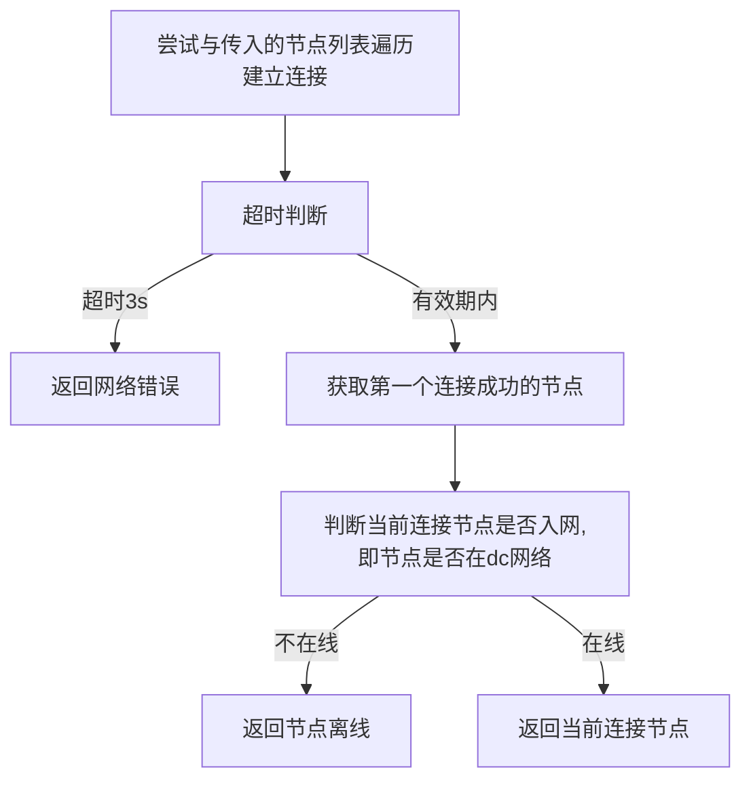
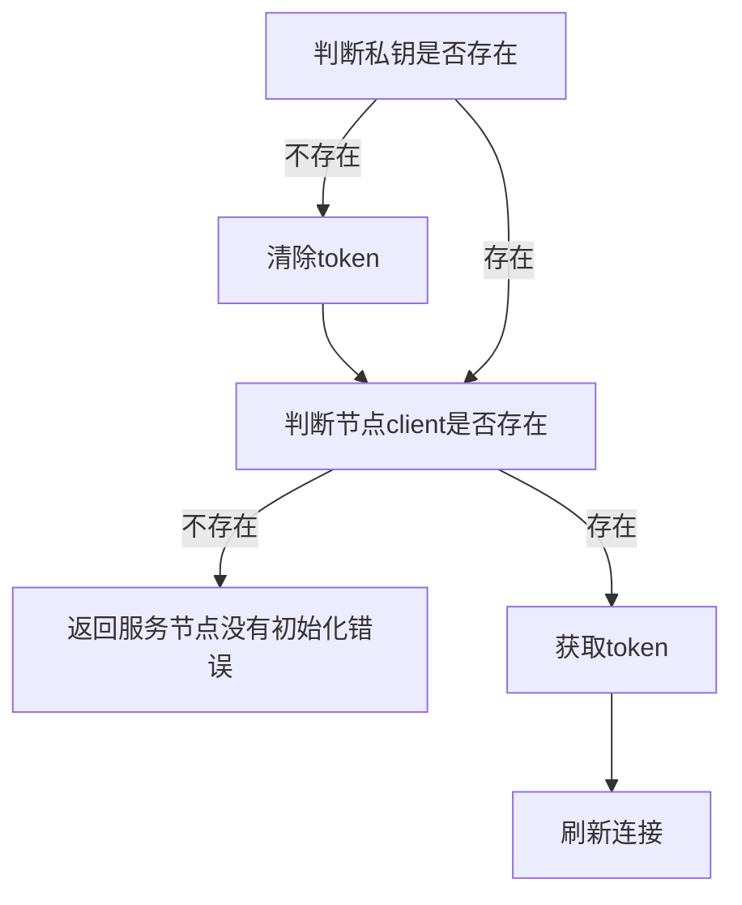
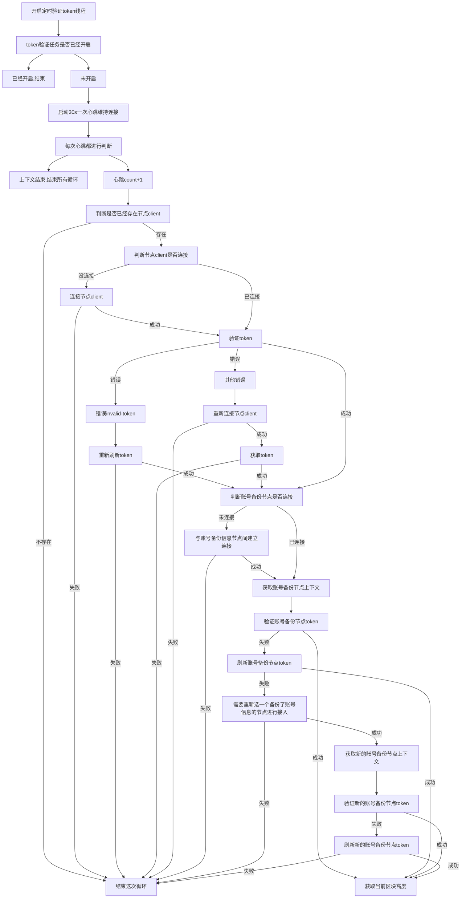

#### 建立与区块链代理的连接connectChainProxy
默认区块链节点：最近连接成功的链节点
区块链代理节点列表：链节点初始化列表+可配置调整（过滤重复）

#### 建立与节点的连接connectDcNode
默认DC节点：最近连接成功的DC节点（有效期）
DC节点列表：链节点获取的DC节点列表+可配置调整（过滤重复）

#### 节点连接状态

#### 尝试与传入的节点列表建立连接bootstrap

#### 刷新token

#### 开启定时验证token线程

// 删除过期数据
// 启动数据库空间监控,当数据库空间不足时，自动分配20M
