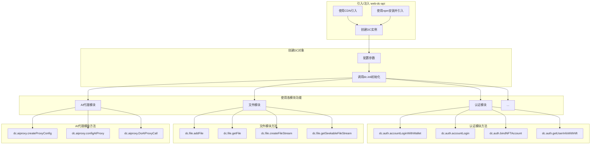
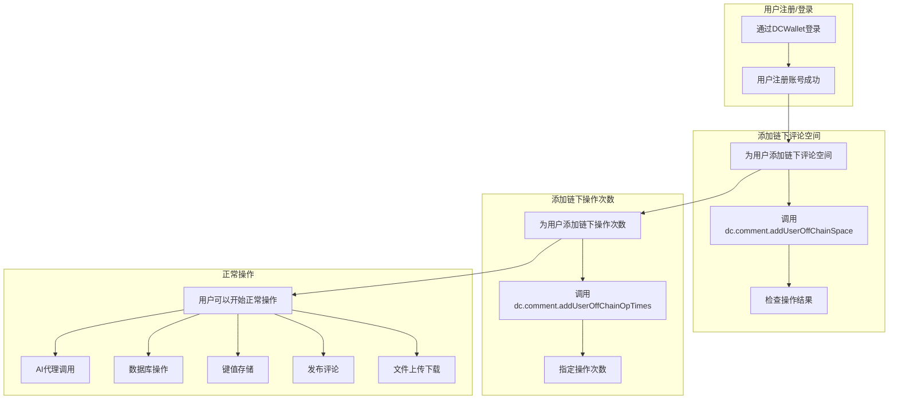

# DCAPI 开发文档

<br>

## 目录

1. 概览
2. 初始化
3. 认证模块 (auth)
4. 文件模块 (file)
5. 客户端模块 (client)
6. 消息模块 (message)
7. 评论模块 (comment)
8. 键值存储模块 (keyvalue)
9. 数据库模块 (database)
10. 缓存模块 (cache)
11. AI代理模块 (aiproxy)
12. 常见使用流程

<br><br>

## 概览

DCAPI 提供了一整套去中心化云服务接口。基于这些接口，开发者只需关注前端的呈现效果。一旦开发完成，应用可以直接打包并发布到 DC 去中心化云服务中，生成访问链接后即可邀请用户使用，无需任何服务器端的部署和维护。如果希望将开发完成的应用发布到自己的域名，只需进行简单的配置即可完成。DC API 提供了身份验证、文件存储、消息传递、评论系统和数据库管理等核心功能，且基于区块链技术，支持各种去中心化应用程序的开发。

<br><br>


## 使用流程

以下是使用DC API的基本流程图，展示了从引入库到使用各个模块的步骤。



DAPP最佳实践是直接使用AccountLoginWithWallet登录,这样可以省去用户注册账号的流程,直接使用DCWallet钱包登录即可。



## 初始化

首先需要创建DC实例并初始化它,可以通过两种方式来引入DC API:

1. 使用CDN引入,必须同时引入web-dc-api和grpc-libp2p-client两个库。
  
```html
<script src="https://cdn.jsdelivr.net/npm/web-dc-api@latest/dist/dc.min.js"></script>
<script src="https://cdn.jsdelivr.net/npm/grpc-libp2p-client@latest/dist/grpc.min.js"></script>
<script>
  const dc = new DC({
    wssUrl: 'wss://chain.baybird.cn', // 区块链路径
    backWssUrl: 'wss://dc.baybird.cn',  // 可选备用区块链路径
    appInfo: {
      appId: 'testHtml',  // 应用ID
      appName: 'testHtml Name',  // 应用名称
      appVersion: 'v0.0.1', // 应用版本号
    },
  });

  // 初始化DC客户端，连接区块链和存储节点
  dc.init().then(() => {
    console.log('DC客户端已初始化');
  });
</script>
```


1. 依赖包引入

```bash
npm install web-dc-api
```

```typescript
import { DC } from 'web-dc-api';

 const dc = new DC({
    wssUrl: 'wss://chain.baybird.cn', // 区块链路径
    backWssUrl: 'wss://dc.baybird.cn',  // 可选备用区块链路径
    appInfo: {
      appId: 'testHtml',  // 应用ID
      appName: 'testHtml Name',  // 应用名称
      appVersion: 'v0.0.1', // 应用版本号
    },
  });

// 初始化DC客户端，连接区块链和存储节点
await dc.init();
```

<br><br>

## 认证模块 (auth)

负责用户身份验证、账户管理和访问控制。如果只是开发DAPP,只要调用accountLoginWithWallet登录即可,可以不用管这个模块的剩余功能,剩余功能大部分都在DCWallet中已经实现,开发者只要专注于认证模块以外的功能即可。(注意:为了用户能正常使用去中心云服务,用户首次注册,并登录成功后,将会消耗一部分云服务token,用来生成链下存储以及链下操作次数)。

### 方法

#### `accountLoginWithWallet()`

直接通过DCWallet钱包登录。DAPP开发者直接调用该方法即可。不需要关注账号密码生成、以及保存等细节。

**返回:** Promise<[boolean,AccountInfo|null]> - 登录响应

```typescript
interface AccountInfo{
      nftAccount:string, // NFT账号
      appAccount:Ed25519PubKey, // 应用专用账号公钥 
      ethAccount:string, // 以太坊兼容链上账号
      chainId:string, // 区块链ID
      chainName:string, // 区块链名称
}
```

<br>

#### `accountLogin(nftAccount, password, safecode)`

用NFT账户登录系统。

**参数:**

- `nftAccount`: string - NFT账户名称
- `password`: string - 密码
- `safecode`: string - 安全码，默认"000000",主要为了加强密码强度

**返回:** Promise<boolean> - 登录是否成功

```typescript
const success = await dc.auth.accountLogin('my-nft-account', 'password', '000000');
if (success) {
  console.log('登录成功');
}
```

<br>

#### `bindNFTAccount(account, password, seccode, mnemonic)`

将私钥绑定到NFT账号。

**参数:**

- `account`: string - NFT账号
- `password`: string - 密码
- `seccode`: string - 安全码
- `mnemonic`: string - 助记词

**返回:** Promise<[NFTBindStatus, Error | null]> - 绑定状态码和错误信息

```typescript
const [status, error] = await dc.auth.bindNFTAccount('nft-id', 'password', 'seccode', 'mnemonic phrase');
if (status === NFTBindStatus.Success) {
  console.log('绑定成功');
}
```

<br>

#### `generateAppAccount(appId, mnemonic)`

创建应用子账号。

**参数:**

- `appId`: string - 应用ID
- `mnemonic`: string - 助记词

**返回:** Promise<[string | null, Error | null]> - 私钥字符串和错误信息

```typescript
const [privateKey, error] = await dc.auth.generateAppAccount('myapp', 'mnemonic phrase');
if (privateKey) {
  console.log('子账号私钥:', privateKey);
}
```

<br>

#### `isNftAccountBindSuccess(account)`

检查NFT账号是否成功绑定到用户公钥。

**参数:**

- `account`: string - NFT账号

**返回:** Promise<boolean> - 是否成功绑定

```typescript
const isBound = await dc.auth.isNftAccountBindSuccess('nft-account');
console.log('NFT账号绑定状态:', isBound);
```

<br>

#### `isNftAccountBinded(account)`

检查NFT账号是否已被任何账号绑定。

**参数:**

- `account`: string - NFT账号

**返回:** Promise<boolean> - 是否已被绑定

```typescript
const isAlreadyBinded = await dc.auth.isNftAccountBinded('nft-account');
console.log('NFT账号是否已被绑定:', isAlreadyBinded);
```

<br>

#### `getUserInfoWithNft(nftAccount)`

根据NFT账户获取用户信息。

**参数:**

- `nftAccount`: string - NFT账户

**返回:** Promise<any> - 用户信息对象

```typescript
const userInfo = await dc.auth.getUserInfoWithNft('nft-account');
console.log('用户信息:', userInfo);
```

<br>

#### `getUserInfoWithAccount(pubkeyAccount: string)`

**参数:**

- `pubkeyAccount`: string - 公钥账号,即pubkey

**返回:** Promise<User> - 用户信息对象

```typescript
const userInfo = await dc.auth.getUserInfoWithAccount('pubkeyAccount');
console.log('用户信息:', userInfo);
```

```typescript
export interface User {
  callMinusNumber: number; //调用手续费单位（与用户订阅的空间大小相关，空间越大这个值越小）
  commentFrozenStatus: number; //评论相关功能(包括keyvalue数据库、主题评论等功能)冻结状态
  commentReportAmount: number; //评论举报次数
  commentReportNumber: number; //下一次消除举报次数的区块高度
  dbConfig: string; //用户个体库配置信息，格式（threadid|sk|rk)加密后的值，（用户公钥加密后的字符串值，用户私钥可以解密）
  dbUpdateNumber: number; //用户个体库信息更新区块高度
  encNftAccount: string; //用户绑定的账号加密后字符串（用户公钥加密后的值，用户私钥可以解密）
  expireNumber: number; //订阅过期区块高度
  loginNumber: number; //登录次数
  nftUpdateNumber: number; //用户nft账号更新区块高度
  offchainOptimes: number; //链下允许总调用次数,当前会一直累加
  offchainSpace: number; //链下允许总调用空间，当前会一直累加
  parentAccount: string; //父账号pubkey
  peers: Array<string>; //账号登录信息存储的节点ID列表
  purchaseNumber: number; //购买次数
  requestPeers: Array<string>; //允许上传文件的节点ID列表,如果不在列表中则无法上传文件,需要先发起绑定请求
  spamFrozenStatus: number; //垃圾信息相关功能冻结状态
  spamReportAmount: number; //垃圾信息举报次数
  spamReportNumber: number; //下一次消除垃圾信息举报次数的区块高度
  subscribePrice: string; //订阅价格
  subscribeSpace: number; //订阅空间大小，单位KB
  usedSpace: number; //已使用空间大小，单位KB
}
```

<br>

#### `ifEnoughUserSpace(needSize?: number)`

**参数:**

- `needSize`: number (可选) - 需要检查的空间大小，单位为字节，默认不传则检查当前用户空间是否足够

**返回:** Promise<boolean> - 是否有足够的用户空间

```typescript
const flag = await dc.auth.ifEnoughUserSpace(100 * 1024*1024); // 检查是否有100MB空间
if (flag) {
  console.log('用户空间足够');
} else {
  console.log('用户空间不足');
}
```

<br>

#### `refreshUserInfo()`

**返回:** Promise<User> - 刷新后的用户信息对象

```typescript
const userInfo = await dc.auth.refreshUserInfo();
console.log('刷新后的用户信息:', userInfo);
```

#### sign(payload: Uint8Array)

**参数:**

- `payload`: Uint8Array - 需要签名的数据

**返回:** Promise<Uint8Array> - 签名结果

```typescript
const payload = new TextEncoder().encode('需要签名的数据');
const signature = await dc.auth.sign(payload);
console.log('签名结果:', signature);
```

<br><br>

## 文件模块 (file)

提供文件上传、下载和缓存功能。

### 方法

#### `addFile(file, enkey, onUpdateTransmitSize)`

上传文件到存储系统。

**参数:**

- `file`: File - 要上传的文件
- `enkey`: string - 加密密钥
- `onUpdateTransmitSize`: (status: number, size: number) => void - 进度回调函数

**返回:** Promise<any> - 上传结果，包含CID等信息

```typescript
const file = new File(['content'], 'test.txt');
const result = await dc.file.addFile(
  file,
  'encryption-key',
  (status, size) => console.log(`上传进度：${status}%, 大小：${size}`)
);
console.log('上传结果:', result);
```

<br>

#### `getFile(cid, decryptKey)`

获取文件内容。

**参数:**

- `cid`: string - 文件内容标识符
- `decryptKey`: string - 解密密钥

**返回:** Promise<Uint8Array | undefined> - 文件字节数组

```typescript
const [fileContent, error] = await dc.file.getFile('QmFileHash...', 'decryption-key');
if (fileContent) {
  console.log('文件内容字节长度:', fileContent.length);
}
```

<br>

#### `createFileStream(cid, decryptKey)`

创建文件可读流，适用于大文件处理。

**参数:**

- `cid`: string - 文件内容标识符
- `decryptKey`: string - 解密密钥

**返回:** Promise<ReadableStream<Uint8Array> | null> - 文件可读流

```typescript
const stream = await dc.file.createFileStream('QmFileHash...', 'decryption-key');
if (stream) {
  // 使用可读流处理文件
  const reader = stream.getReader();
  while (true) {
    const { done, value } = await reader.read();
    if (done) break;
    console.log('读取数据块:', value.length);
  }
}
```

<br>

#### `getSeekableFileStream(ipfsPath, decryptKey)`

获取支持随机访问的文件流，适用于视频播放等场景。

**参数:**

- `ipfsPath`: string - IPFS路径或CID
- `decryptKey`: string - 解密密钥

**返回:** Promise<SeekableFileStream> - 可随机访问的文件流

```typescript
const seekableStream = await dc.file.getSeekableFileStream('/ipfs/QmFileHash...', 'decryption-key');
// 从文件的第1000字节开始读取
const data = await seekableStream.read(1000, 1024);
console.log('读取的数据:', data);
```

<br>

#### `clearFileCache(pathname)`

清理文件缓存。

**参数:**

- `pathname`: string (可选) - 特定文件路径，不提供则清除所有缓存

**返回:** void

```typescript
// 清理特定文件缓存
dc.file.clearFileCache('/ipfs/QmFileHash...');

// 清理所有缓存
dc.file.clearFileCache();
```

<br><br>

## 客户端模块 (client)

提供底层节点连接和网络通信功能。

### 方法

#### `getHostID()`

获取当前连接的节点ID和客户端公网地址。

**参数:** 无

**返回:** Promise<[{ peerID: string; reqAddr: string } | null, Error | null]> - 主机信息和错误

```typescript
const [hostInfo, error] = await dc.client.getHostID();
if (hostInfo) {
  console.log('节点ID:', hostInfo.peerID);
  console.log('客户端公网地址:', hostInfo.reqAddr);
}
```

<br><br>

## 消息模块 (message)

提供用户消息盒子的发送和接收功能。

### 方法

#### `sendMsgToUserBox(receiver, msg)`

向用户消息盒子发送消息。

**参数:**

- `receiver`: string - 接收者的公钥
- `msg`: string - 消息内容

**返回:** Promise<any> - 发送结果，包含消息ID和时间戳

```typescript
const result = await dc.message.sendMsgToUserBox('receiver-pubkey', 'Hello World!');
console.log('消息发送结果:', result);
```

<br>

#### `getMsgFromUserBox(limit)`

获取当前用户消息盒子中的消息。

**参数:**

- `limit`: number (可选) - 返回消息的最大数量

**返回:** Promise<any> - 消息列表

```typescript
const messages = await dc.message.getMsgFromUserBox(10);
console.log('收到的消息:', messages);
```

<br><br>

## 评论模块 (comment)

提供主题评论功能。

### 方法

#### `addUserOffChainSpace()`

为当前用户添加链下评论空间。当用户首次登录成功后,应该先调用此方法来完成链下空间配置。如果是集成sdk,sdk会自动完成这部操作。

**参数:** 无

**返回:** Promise<[boolean | null, Error | null]> - 操作结果

```typescript
const [success, error] = await dc.comment.addUserOffChainSpace();
if (success) {
  console.log('成功添加用户评论空间');
}
```

<br>

#### `addUserOffChainOpTimes(times, vaccount?)`

为用户添加链下操作次数,DC为了提升性能,用户发布评论等操作,无需上链,用于发布评论等链下操作次数,当用户首次登录成功后,应该先调用此方法来完成链下操作次数配置。如果是集成sdk,sdk会自动完成这部操作。

**参数:**

- `times`: number - 操作次数
- `vaccount`: string (可选) - 用户的虚拟账号

**返回:** Promise<[boolean | null, Error | null]> - 操作结果, 0:成功 1:评论空间没有配置 2:评论空间不足 3:评论数据同步中

```typescript
const [result, error] = await dc.comment.addUserOffChainOpTimes(10);
if (result) {
  console.log('成功添加用户链下操作次数');
}
```

<br>

#### `getThemeObj(themeAuthor, startHeight, direction, offset, limit, seekKey)`

获取指定用户的主题对象列表。

**参数:** Promise<string> - 主题对象列表

```javascript
const themes = await dc.comment.getThemeObj(
  'author-pubkey',
  0, // 起始高度
  0, // 从新到旧
  0, // 不偏移
  50, // 最多返回50条
  '' // 不使用起始键
);
console.log('主题对象列表:', themes);
```

<br>

#### `addThemeObj(theme, openFlag, commentSpace)`

为指定主题开通评论功能。

**参数:**

- `theme`: string - 主题标识符
- `openFlag`: OpenFlag - 评论可见性标志
- `commentSpace`: number (可选) - 评论空间大小，默认50MB

**返回:** Promise<[number | null, Error | null]> - 状态码和错误

```typescript
const [status, error] = await dc.comment.addThemeObj(
  'my-article-1',
  OpenFlag.PUBLIC, // 评论设为公开
  100 * 1024 * 1024 // 100MB
);
if (status === 0) {
  console.log('成功开通评论功能');
}
```

<br>

#### `addThemeSpace(theme, addSpace)`

为已开通评论的主题增加评论空间。

**参数:**

- `theme`: string - 主题标识符
- `addSpace`: number - 增加的空间大小(字节)

**返回:** Promise<any> - 操作结果

```typescript
const result = await dc.comment.addThemeSpace('my-article-1', 50 * 1024 * 1024); // 增加50MB
console.log('增加空间结果:', result);
```

<br>

#### `publishCommentToTheme(theme, themeAuthor, commentType, comment, refercommentkey, openFlag)`

发表评论到指定主题。

**参数:**

- `theme`: string - 主题标识符
- `themeAuthor`: string - 主题作者的公钥
- `commentType`: number - 评论类型 (0:普通评论, 1:回复评论等)
- `comment`: string - 评论内容
- `refercommentkey`: string (可选) - 引用评论的键
- `openFlag`: number (可选) - 评论可见性

**返回:** Promise<any> - 发布结果

```typescript
const result = await dc.comment.publishCommentToTheme(
  'my-article-1',
  'author-pubkey',
  0, // 普通评论
  '这是一条评论内容',
  '', // 不引用其他评论
  OpenFlag.PUBLIC // 公开评论
);
console.log('评论发布结果:', result);
```

<br>

#### `deleteSelfComment(theme, themeAuthor, commentKey)`

删除自己发布的评论。

**参数:**

- `theme`: string - 主题标识符
- `themeAuthor`: string - 主题作者的公钥
- `commentKey`: string - 评论的唯一键

**返回:** Promise<any> - 删除结果

```typescript
const result = await dc.comment.deleteSelfComment(
  'my-article-1',
  'author-pubkey',
  'comment-key-123'
);
console.log('删除评论结果:', result);
```

<br>

#### `getThemeComments(theme, themeAuthor, startHeight, direction, offset, limit, seekKey)`

获取指定主题的评论列表,无法查询作者设置为私密的评论

**参数:**

- `theme`: string - 主题标识符
- `themeAuthor`: string - 主题作者的公钥
- `startHeight`: number (可选) - 查询起始高度，默认0
- `direction`: number (可选) - 查询方向 (0:从新到旧, 1:从旧到新)，默认0
- `offset`: number (可选) - 结果集偏移量，默认0
- `limit`: number (可选) - 最大返回数量，默认100
- `seekKey`: string (可选) - 查询的起始键，格式为"blockheight/key"

**返回:** Promise<any> - 评论列表

```typescript
const comments = await dc.comment.getThemeComments(
  'my-article-1',
  'author-pubkey',
  0, // 起始高度
  0, // 从新到旧
  0, // 不偏移
  50 // 最多返回50条
);
console.log('主题评论:', comments);
```

<br>

#### `configAuth( themeAuthor, theme, authPubkey, permission, remark, vaccount)`

配置主题的授权信息,即为其他用户授权评论权限。

**参数:**

- `themeAuthor`: string - 主题作者的公钥
- `theme`: string - 主题名称
- `authPubkey`: string - 被授权者的公钥
- `permission`: ThemePermission - 权限级别 (1:只读, 3:读写)
- `remark`: string - 备注信息
- `vaccount`: string (可选) - 虚拟账户
  
**返回:** Promise<[number, Error | null]> - 状态码和错误信息

```typescript
const [status, error] = await dc.comment.configAuth(
  'theme-author-pubkey',
  'my-article-1',
  'user-to-authorize-pubkey',
  ThemePermission.READ, // 只读权限 
  '测试授权'
);
if (status === 0) {
  console.log('授权配置成功');
}
``` 

```typescript

/**
 * 主题的操作权限
 */
export enum ThemePermission {
  /** 无权限 */
  NONE = 0,
  /** 申请权限 */
  APPLY,
  /** 读权限 */
  READ,
  /** 写权限 */
  WRITE,
  /** 管理员权限 */
  ADMIN,
  /** 
   * 只写权限
   * 不允许用户修改remark或者物联网设备上报数据使用
   * 权限后面跟随分组列表,以逗号分隔
   */
  ONLY_WRITE,
  /** 物联网管理人员相关权限,具体权限后续可扩展 */
  DEVICE,
  /** 不存在 */
  NOT_EXIST,
  /** 查询权限,系统可以查询数据,用户只能查询自己的授权数据 */
  QUERY
}
```

<br>

#### `getAuthList(themeAuthor, theme, vaccount)`

获取指定主题的授权列表

**参数:**

- `themeAuthor`: string - 主题作者的公钥
- `theme`: string - 主题/对象标识符
- `vaccount`: string (可选) - 虚拟账户
  
**返回:** Promise<[ThemeAuthInfo[] | null, ThemeComment[] | null, Error | null]> - 存授权列表、评论列表格式的授权列表(带原始签名)和错误信息

```typescript
const [authList, commentList, error] = await dc.comment.getAuthList(
  'theme-author-pubkey',
  'my-article-1',
  'virtual-account-id' // 可选
);
if (authList) {
  console.log('授权列表:', authList);
  console.log('评论格式列表:', commentList);
}
```

<br>

#### `getUserComments(userPubkey, startHeight, direction, offset, limit, seekKey)`

获取指定用户发布的评论列表,无法查询用户设置为私密的评论

**参数:**

- `userPubkey`: string - 用户公钥
- `startHeight`: number (可选) - 查询起始高度，默认0
- `direction`: number (可选) - 查询方向 (0:从新到旧, 1:从旧到新)，默认0
- `offset`: number (可选) - 结果集偏移量，默认0
- `limit`: number (可选) - 最大返回数量，默认100
- `seekKey`: string (可选) - 查询的起始键，格式为"blockheight/key"
  
**返回:** Promise<string> - 用户的评论列表

```typescript
const userComments = await dc.comment.getUserComments(
  'user-pubkey',
  0, // 起始高度
  0, // 从新到旧
  0, // 不偏移
  50, // 最多返回50条
  '' // 不使用起始键
);
console.log('用户评论列表:', userComments);
```

<br><br>

## 键值存储模块 (keyvalue)

提供分布式键值存储功能。

### 方法

#### `createStore(appId, theme, space, type)`

创建一个键值存储主题。传入的空间大小如果少于100M,将会自动分配100M空间,如果传入的空间大于100M,则会分配指定大小的空间。

**参数:**

- `appId`: string - 应用ID
- `theme`: string - 主题名称
- `space`: number - 分配的存储空间大小(字节)
- `type`: KeyValueStoreType - 存储类型 (1: 鉴权主题-读写都需要鉴权, 2: 公共主题-默认所有用户可读,写需要鉴权)

**返回:** Promise<KeyValueDB> - 创建的keyvalue数据库实例

```typescript
const result = await dc.keyvalue.createStore(
  'myapp',
  'my-app-settings',
  100 * 1024 * 1024, // 100MB
  1 // 认证存储
);
console.log('创建存储结果:', result);
```

<br>

#### `getStore(appId, theme, themeAuthor)`

获取指定主题的keyvalue数据库实例。

**参数:**

- `appId`: string - 应用ID
- `theme`: string - 主题名称
- `themeAuthor`: string - 数据库创建者的公钥

**返回:** Promise<KeyValueDB> - keyvalue数据库实例

```typescript
const store = await dc.keyvalue.getStore(
  'myapp',
  'my-app-settings',
  'theme-author-pubkey'
);
console.log('获取到存储实例:', store);
```

<br>

#### `configAuth(kvdb, authPubkey, permission, remark, vaccount)`

配置主题的授权信息。

**参数:**

- `kvdb`: KeyValueDB - keyvalue数据库实例
- `authPubkey`: string - 被授权者的公钥
- `permission`: ThemePermission - 权限级别
- `remark`: string - 备注信息
- `vaccount`: string (可选) - 虚拟账户

**返回:** Promise<[number, Error | null]> - 状态码和错误信息

```typescript
const store = await dc.keyvalue.getStore(
  'myapp',
  'my-app-settings', 
  'theme-author-pubkey'
);

const [status, error] = await dc.keyvalue.configAuth(
  store,
  'user-to-authorize-pubkey',
  ThemePermission.READ, // 只读权限
  '测试授权'
);

if (status === 0) {
  console.log('授权配置成功');
}
```

<br>

#### `getAuthList(kvdb, vaccount)`

获取指定keyvalue的授权列表。

**参数:**

- `kvdb`: KeyValueDB - keyvalue数据库实例
- `vaccount`: string (可选) - 虚拟账户

**返回:** Promise<[ThemeAuthInfo[] | null, ThemeComment[] | null, Error | null]> - 授权列表、含签名的原始授权列表和错误信息

```typescript
const store = await dc.keyvalue.getStore(
  'myapp',
  'my-app-settings',
  'theme-author-pubkey'
);

const [authList, commentList, error] = await dc.keyvalue.getAuthList(
  store,
  'virtual-account-id' // 可选
);

if (authList) {
  console.log('授权列表:', authList);
  console.log('评论格式列表:', commentList);
}
```

<br>

#### `set(kvdb, key, value, indexs, vaccount)`

设置键值对，支持索引功能。

**参数:**

- `kvdb`: KeyValueDB - keyvalue数据库实例
- `key`: string - 键名
- `value`: string - 值内容
- `indexs`: string - 索引列表，格式为"key1:value1$$$key2:value2"，设置索引后可通过索引快速定位
- `vaccount`: string (可选) - 虚拟账户

**返回:** Promise<[boolean, Error | null]> - 成功状态和错误信息

```typescript
const store = await dc.keyvalue.getStore(
  'myapp',
  'my-app-settings',
  'theme-author-pubkey'
);

const [success, error] = await dc.keyvalue.set(
  store,
  'user:prefs',
  JSON.stringify({theme: 'dark', fontSize: 14}),
  'type:prefs$$$user:123', // 设置两个索引
  'virtual-account-id' // 可选
);

if (success) {
  console.log('数据保存成功');
}
```

<br>

#### `get(kvdb, key, writerPubkey, vaccount)`

获取指定键的值。

**参数:**

- `kvdb`: KeyValueDB - keyvalue数据库实例
- `key`: string - 键名
- `writerPubkey`: string (可选) - 写入者的公钥，默认为主题作者
- `vaccount`: string (可选) - 虚拟账户

**返回:** Promise<[string, Error | null]> - 值内容和错误信息

```typescript
const store = await dc.keyvalue.getStore(
  'myapp',
  'my-app-settings',
  'theme-author-pubkey'
);

const [value, error] = await dc.keyvalue.get(
  store,
  'user:prefs',
  'writer-pubkey', // 可选，默认为主题作者
  'virtual-account-id' // 可选
);

if (value) {
  const prefs = JSON.parse(value);
  console.log('用户偏好设置:', prefs);
}
```

<br>

#### `getBatch(kvdb, keys, writerPubkey, vaccount)`

批量获取多个键的值。

**参数:**

- `kvdb`: KeyValueDB - keyvalue数据库实例
- `keys`: string - 键名列表，多个键用$$$分隔
- `writerPubkey`: string (可选) - 写入者的公钥，默认为主题作者
- `vaccount`: string (可选) - 虚拟账户

**返回:** Promise<[string, Error | null]> - JSON格式查询结果和错误信息

```typescript
const store = await dc.keyvalue.getStore(
  'myapp',
  'my-app-settings',
  'theme-author-pubkey'
);

const [results, error] = await dc.keyvalue.getBatch(
  store,
  'user:prefs$$$user:settings', // 多个键用$$$分隔
  'writer-pubkey', // 可选，默认为主题作者
  'virtual-account-id' // 可选
);

if (results) {
  const values = JSON.parse(results);
  console.log('获取的键值对:', values);
}
```

<br>

#### `getWithIndex(kvdb, indexKey, indexValue, limit, seekKey, offset, vaccount)`

通过索引查询键值对。

**参数:**

- `kvdb`: KeyValueDB - keyvalue数据库实例
- `indexKey`: string - 索引键名
- `indexValue`: string - 索引值
- `limit`: number - 返回结果数量限制
- `seekKey`: string - 查询起始键
- `offset`: number - 结果偏移量
- `vaccount`: string (可选) - 虚拟账户

**返回:** Promise<[string, Error | null]> - JSON格式查询结果和错误信息

```typescript
const store = await dc.keyvalue.getStore(
  'myapp',
  'my-app-settings',
  'theme-author-pubkey'
);

const [results, error] = await dc.keyvalue.getWithIndex(
  store,
  'type', // 索引键
  'prefs', // 索引值
  100, // 最大返回数量
  '', // 查询起始键
  0, // 偏移量
  'virtual-account-id' // 可选
);

if (results) {
  const items = JSON.parse(results);
  console.log('索引查询结果:', items);
}
```

<br>

## 简化使用示例

```typescript
// 完整的键值存储使用流程示例

// 1. 创建存储主题
await dc.keyvalue.createStore('myapp', 'app-settings', 10 * 1024 * 1024, 1);

// 2. 获取存储实例
const store = await dc.keyvalue.getStore('myapp', 'app-settings', dc.auth.getPublicKey());

// 3. 存储用户偏好设置
await dc.keyvalue.set(
  store,
  'user:preferences',
  JSON.stringify({
    theme: 'dark',
    fontSize: 16,
    notifications: true
  }),
  'type:preferences$$$user:current' // 设置两个索引
);

// 4. 读取用户偏好设置
const [prefsData, error] = await dc.keyvalue.get(store, 'user:preferences');
if (prefsData) {
  const preferences = JSON.parse(prefsData);
  console.log('用户偏好设置:', preferences);
}

// 5. 根据索引查询所有偏好设置类型的数据
const [indexed, indexError] = await dc.keyvalue.getWithIndex(
  store,
  'type', // 索引键
  'preferences', // 索引值
  50, // 最多返回50条
  '', // 不使用起始键
  0 // 不偏移
);

if (indexed) {
  const allPreferences = JSON.parse(indexed);
  console.log('所有偏好设置:', allPreferences);
}
```
 
<br><br>

## 数据库模块 (database)

数据库模块提供基于ThreadDB的分布式数据库管理功能，支持创建、同步、查询和修改数据。数据库主要由threadid确保唯一，结合servicekey和readkey多重加密确保数据安全，其中readkey永远不离开用户，而servicekey会在DC云端的TEE环境中参与数据备份。

## 方法

### `initDBManager()`

初始化数据库管理器，创建数据库操作所需的组件和服务。

**参数:** 无

**返回:** Promise<void>

**异常:** 初始化失败时抛出错误

```typescript
// 初始化数据库管理器
await dc.database.initDBManager();
console.log('数据库管理器已初始化');
```

<br>

### `newDB(name, b32Rk, b32Sk, jsonCollections)`

创建新数据库。

**参数:**

- `name`: string - 数据库名称
- `b32Rk`: string - base32编码的读取密钥
- `b32Sk`: string - base32编码的服务密钥
- `jsonCollections`: ICollectionConfig[] - 集合配置数组，定义数据库中的集合结构

**返回:** Promise<string> - 创建的threadID

**异常:** 创建失败时抛出错误

```typescript
// 定义集合配置
const collections = [
  {
    name: 'users',
    schema: {
      title: 'User',
      type: 'object',
      properties: {
        _id: { type: 'string' },
        name: { type: 'string' },
        email: { type: 'string' },
        age: { type: 'integer' }
      },
      required: ['_id', 'name', 'email']
    }
  },
  {
    name: 'posts',
    schema: {
      title: 'Post',
      type: 'object',
      properties: {
        _id: { type: 'string' },
        title: { type: 'string' },
        content: { type: 'string' },
        authorId: { type: 'string' }
      }
    }
  }
];

// 创建数据库
const threadId = await dc.database.newDB(
  'myApplication',
  'base32ReadKey123456789ABCDEF',
  'base32ServiceKey987654321FEDCBA',
  collections
);

console.log('创建数据库成功，threadID:', threadId);
```

<br>

### `syncDbFromDC(threadid, dbname, dbAddr, b32Rk, b32Sk, block, collectionInfos)`

从分布式网络同步数据库。

**参数:**

- `threadid`: string - threadID
- `dbname`: string - 数据库名称
- `dbAddr`: string - 数据库地址
- `b32Rk`: string - base32编码的读取密钥
- `b32Sk`: string - base32编码的服务密钥
- `block`: boolean - 是否阻塞等待同步完成
- `collectionInfos`: ICollectionConfig[] - 集合配置数组，定义数据库中的集合结构

**返回:** Promise<void>

**异常:** 同步失败时抛出错误

```typescript
// 同步数据库配置
const collections = [
  {
    name: 'users',
    schema: {
      title: 'User',
      type: 'object',
      properties: {
        _id: { type: 'string' },
        name: { type: 'string' },
        email: { type: 'string' }
      }
    }
  }
];

// 从分布式网络同步数据库
await dc.database.syncDbFromDC(
  'bafk3epa4rnnhworywhk6hsi7wafwgdt3fkgvpf62wqlriwpwqjwjuqbf4',  // threadID
  'sharedDatabase',  // 数据库名称
  'database.example.com',  // 数据库地址
  'base32ReadKey123456789ABCDEF',  // 读取密钥
  'base32ServiceKey987654321FEDCBA',  // 服务密钥
  true,  // 阻塞等待同步完成
  collections  // 集合配置
);

console.log('数据库同步完成');
```

<br>

### `refreshDBFromDC(threadid)`

刷新数据库，从分布式网络获取最新数据。

**参数:**

- `threadid`: string - 数据库threadID

**返回:** Promise<Error | null> - 错误信息或null表示成功

```typescript
// 刷新数据库，获取最新数据
const error = await dc.database.refreshDBFromDC('bafk3epa4rnnhworywhk6hsi7wafwgdt3fkgvpf62wqlriwpwqjwjuqbf4');

if (error === null) {
  console.log('数据库刷新成功');
} else {
  console.error('刷新数据库时出错:', error.message);
}
```

<br>

### `syncDBToDC(tId)`

同步数据库到分布式网络。

**参数:**

- `tId`: string - threadID

**返回:** Promise<Error | null> - 错误信息或null表示成功

```typescript
// 将本地数据库同步到分布式网络
const error = await dc.database.syncDBToDC('bafk3epa4rnnhworywhk6hsi7wafwgdt3fkgvpf62wqlriwpwqjwjuqbf4');

if (error === null) {
  console.log('数据库已同步到分布式网络');
} else {
  console.error('同步数据库时出错:', error.message);
}
```

<br>

### `close()`

关闭数据库管理器。

**参数:** 无

**返回:** Promise<void>

**异常:** 关闭失败时抛出错误

```typescript
// 关闭数据库管理器
await dc.database.close();
console.log('数据库管理器已关闭');
```

<br>

### `create(threadId, collectionName, jsonInstance)`

在集合中创建新对象实例。

**参数:**

- `threadId`: string - threadID
- `collectionName`: string - 集合名称
- `jsonInstance`: string - JSON字符串表示的实例对象

**返回:** Promise<string> - 创建的实例ID

**异常:** 创建失败时抛出错误

```typescript
// 创建用户实例
const user = {
  name: 'John Doe',
  email: 'john@example.com',
  age: 28
};

// 将对象序列化为JSON字符串
const userJson = JSON.stringify(user);

// 在用户集合中创建新实例
const instanceId = await dc.database.create(
  'bafk3epa4rnnhworywhk6hsi7wafwgdt3fkgvpf62wqlriwpwqjwjuqbf4',  // threadID
  'users',  // 集合名称
  userJson  // JSON字符串表示的实例对象
);

console.log('创建的用户ID:', instanceId);

// 创建文章实例
const post = {
  title: '分布式数据库入门',
  content: '这是一篇关于ThreadDB的介绍文章...',
  authorId: instanceId
};

const postJson = JSON.stringify(post);

const postId = await dc.database.create(
  'bafk3epa4rnnhworywhk6hsi7wafwgdt3fkgvpf62wqlriwpwqjwjuqbf4',
  'posts',
  postJson
);

console.log('创建的文章ID:', postId);
```

<br>

### `delete(threadId, collectionName, instanceID)`

通过ID删除实例。

**参数:**

- `threadId`: string - threadID
- `collectionName`: string - 集合名称
- `instanceID`: string - 要删除的实例ID

**返回:** Promise<void>

**异常:** 删除失败时抛出错误

```typescript
// 删除指定ID的用户
await dc.database.delete(
  'bafk3epa4rnnhworywhk6hsi7wafwgdt3fkgvpf62wqlriwpwqjwjuqbf4',  // threadID
  'users',  // 集合名称
  'bafybeihykld5rmrxzs7odlrjil6ntnoaqbkbq2dhzhsajomnsvgcbiewvu'  // 要删除的实例ID
);

console.log('用户已删除');
```

<br>

### `save(threadId, collectionName, instance)`

更新已存在的实例。

**参数:**

- `threadId`: string - threadID
- `collectionName`: string - 集合名称
- `instance`: string - JSON字符串表示的实例对象

**返回:** Promise<void>

**异常:** 更新失败时抛出错误

```typescript
// 获取要更新的用户
const userJson = await dc.db.findByID(
  'bafk3epa4rnnhworywhk6hsi7wafwgdt3fkgvpf62wqlriwpwqjwjuqbf4',
  'users',
  'bafybeihykld5rmrxzs7odlrjil6ntnoaqbkbq2dhzhsajomnsvgcbiewvu'
);

// 解析JSON
const user = JSON.parse(userJson);

// 更新用户信息
user.age = 29;
user.email = 'john.doe@example.com';

// 保存更新后的用户
await dc.database.save(
  'bafk3epa4rnnhworywhk6hsi7wafwgdt3fkgvpf62wqlriwpwqjwjuqbf4',  // threadID
  'users',  // 集合名称
  JSON.stringify(user)  // 更新后的实例JSON
);

console.log('用户信息已更新');
```

<br>

### `deleteMany(threadId, collectionName, instanceIDs)`

批量删除多个实例。

**参数:**

- `threadId`: string - threadID
- `collectionName`: string - 集合名称
- `instanceIDs`: string - 逗号分隔或JSON数组表示的实例ID列表

**返回:** Promise<void>

**异常:** 删除失败时抛出错误

```typescript
// 删除多个文章实例
const postIds = [
  'bafybeihykld5rmrxzs7odlrjil6ntnoaqbkbq2dhzhsajomnsvgcbiewvu',
  'bafybeidagua3wl5vdbcszskuoez7gafvubobrw6kprxvptcsi3f42qeium'
];

// 方式1: 使用JSON数组
await dc.database.deleteMany(
  'bafk3epa4rnnhworywhk6hsi7wafwgdt3fkgvpf62wqlriwpwqjwjuqbf4',  // threadID
  'posts',  // 集合名称
  JSON.stringify(postIds)  // JSON数组
);

// 方式2: 使用逗号分隔的字符串
await dc.database.deleteMany(
  'bafk3epa4rnnhworywhk6hsi7wafwgdt3fkgvpf62wqlriwpwqjwjuqbf4',  // threadID
  'posts',  // 集合名称
  'bafybeihykld5rmrxzs7odlrjil6ntnoaqbkbq2dhzhsajomnsvgcbiewvu,bafybeidagua3wl5vdbcszskuoez7gafvubobrw6kprxvptcsi3f42qeium'  // 逗号分隔的ID
);

console.log('多篇文章已删除');
```

<br>

### `has(threadId, collectionName, instanceID)`

检查指定实例是否存在。

**参数:**

- `threadId`: string - threadID
- `collectionName`: string - 集合名称
- `instanceID`: string - 要检查的实例ID

**返回:** Promise<boolean> - 布尔值表示实例是否存在

```typescript
// 检查用户是否存在
const exists = await dc.database.has(
  'bafk3epa4rnnhworywhk6hsi7wafwgdt3fkgvpf62wqlriwpwqjwjuqbf4',  // threadID
  'users',  // 集合名称
  'bafybeihykld5rmrxzs7odlrjil6ntnoaqbkbq2dhzhsajomnsvgcbiewvu'  // 实例ID
);

if (exists) {
  console.log('用户存在');
} else {
  console.log('用户不存在');
}
```

<br>

### `find(threadId, collectionName, queryString)`

根据查询条件查找实例。

**参数:**

- `threadId`: string - threadID
- `collectionName`: string - 集合名称
- `queryString`: string - JSON字符串表示的查询条件,
  格式举例:(condition表示and条件组合, ors表示或条件组合, sort表示排序, seek表示分页)
  格式1: `{"condition":"age=80 and name='John'"}`,"sort":{"fieldPath":"age","desc":true}}`
  格式2: `{"ors":[{"condition":"age = 21 and name = 'foo'"}]}`
  格式3: `{"condition":"age > 21 ","ors":[{"condition":"age = 21 and name = 'foo'"}],"sort":{"fieldPath":"age","desc":true},"seek":"01fyc691gh671nf0s8qpt0ych8"}`

**返回:** Promise<string> - JSON字符串表示的查询结果

**异常:** 查询失败时抛出错误

```typescript
// 示例1: 简单查询 - 查找年龄为28的用户
const query1 = {
  condition: "age = 28"
};
const results1 = await dc.db.find(
  'bafk3epa4rnnhworywhk6hsi7wafwgdt3fkgvpf62wqlriwpwqjwjuqbf4',
  'users',
  JSON.stringify(query1)
);
console.log('28岁的用户:', JSON.parse(results1));

// 示例2: 组合条件查询 - 查找年龄大于25且名字为John的用户
const query2 = {
  condition: "age > 25 and name = 'John Doe'"
};
const results2 = await dc.db.find(
  'bafk3epa4rnnhworywhk6hsi7wafwgdt3fkgvpf62wqlriwpwqjwjuqbf4',
  'users',
  JSON.stringify(query2)
);
console.log('年龄大于25的John:', JSON.parse(results2));

// 示例3: 使用OR条件查询 - 查找年龄为21或名字为Jane的用户
const query3 = {
  ors: [
    { condition: "age = 21" },
    { condition: "name = 'Jane Smith'" }
  ]
};
const results3 = await dc.db.find(
  'bafk3epa4rnnhworywhk6hsi7wafwgdt3fkgvpf62wqlriwpwqjwjuqbf4',
  'users',
  JSON.stringify(query3)
);
console.log('21岁或名为Jane的用户:', JSON.parse(results3));

// 示例4: 带排序和分页的复杂查询
const query4 = {
  condition: "age > 20",
  ors: [
    { condition: "name = 'John Doe'" }
  ],
  sort: {
    fieldPath: "age",
    desc: true  // 从大到小排序
  },
  seek: "01fyc691gh671nf0s8qpt0ych8"  // 分页标记
};
const results4 = await dc.db.find(
  'bafk3epa4rnnhworywhk6hsi7wafwgdt3fkgvpf62wqlriwpwqjwjuqbf4',
  'users',
  JSON.stringify(query4)
);
console.log('复杂查询结果:', JSON.parse(results4));
```

<br>

### `findByID(threadId, collectionName, instanceID)`

通过ID查找实例。

**参数:**

- `threadId`: string - threadID
- `collectionName`: string - 集合名称
- `instanceID`: string - 实例ID

**返回:** Promise<string> - JSON字符串表示的实例

**异常:** 查询失败时抛出错误

```typescript
// 通过ID查找用户
const userJson = await dc.db.findByID(
  'bafk3epa4rnnhworywhk6hsi7wafwgdt3fkgvpf62wqlriwpwqjwjuqbf4',  // threadID
  'users',  // 集合名称
  'bafybeihykld5rmrxzs7odlrjil6ntnoaqbkbq2dhzhsajomnsvgcbiewvu'  // 实例ID
);

if (userJson) {
  const user = JSON.parse(userJson);
  console.log('找到的用户:', user);
} else {
  console.log('未找到用户');
}
```

<br>

### `modifiedSince(threadId, collectionName, time)`

获取在指定时间后被修改的实例ID列表。

**参数:**

- `threadId`: string - threadID
- `collectionName`: string - 集合名称
- `time`: number - 时间戳（毫秒）

**返回:** Promise<string> - JSON字符串表示的实例ID列表

**异常:** 查询失败时抛出错误

```typescript
// 获取过去24小时内修改的所有用户ID
const oneDayAgo = Date.now() - (24 * 60 * 60 * 1000); // 24小时前的时间戳(毫秒)

const modifiedIdsJson = await dc.database.modifiedSince(
  'bafk3epa4rnnhworywhk6hsi7wafwgdt3fkgvpf62wqlriwpwqjwjuqbf4',  // threadID
  'users',  // 集合名称
  oneDayAgo  // 时间戳(毫秒)
);

const modifiedIds = JSON.parse(modifiedIdsJson);
console.log('最近24小时内修改的用户ID:', modifiedIds);

// 如果有修改的用户，获取他们的详细信息
if (modifiedIds.length > 0) {
  // 获取第一个修改用户的详细信息
  const userJson = await dc.db.findByID(
    'bafk3epa4rnnhworywhk6hsi7wafwgdt3fkgvpf62wqlriwpwqjwjuqbf4',
    'users',
    modifiedIds[0]
  );
  
  console.log('最近修改的用户信息:', JSON.parse(userJson));
}
```

<br>

## 完整使用示例

```typescript
// 示例: 创建并使用一个任务管理数据库

async function taskManagerExample() {
  try {
    // 1. 初始化数据库管理器
    await dc.database.initDBManager();
    console.log('数据库管理器已初始化');
    
    // 2. 定义集合配置
    const collections = [
      {
        name: 'tasks',
        schema: {
          title: 'Task',
          type: 'object',
          properties: {
            _id: { type: 'string' },
            title: { type: 'string' },
            description: { type: 'string' },
            status: { type: 'string', enum: ['todo', 'in-progress', 'done'] },
            priority: { type: 'integer', minimum: 1, maximum: 5 },
            dueDate: { type: 'string', format: 'date-time' },
            createdAt: { type: 'string', format: 'date-time' },
            updatedAt: { type: 'string', format: 'date-time' }
          },
          required: ['_id', 'title', 'status', 'priority', 'createdAt']
        }
      }
    ];
    
    // 3. 创建新数据库
    const threadId = await dc.database.newDB(
      'taskManager',
      'base32ReadKeyXXXXXXXXXXXXXXXX',
      'base32ServiceKeyYYYYYYYYYYYYYY',
      collections
    );
    console.log('任务管理数据库已创建，threadID:', threadId);
    
    // 4. 创建任务实例
    const task1 = {
      title: '完成数据库接口文档',
      description: '为ThreadDB接口编写详细文档和示例代码',
      status: 'in-progress',
      priority: 4,
      dueDate: new Date(Date.now() + 86400000).toISOString(), // 明天
      createdAt: new Date().toISOString(),
      updatedAt: new Date().toISOString()
    };
    
    const task1Id = await dc.database.create(
      threadId,
      'tasks',
      JSON.stringify(task1)
    );
    console.log('创建的任务ID:', task1Id);
    
    const task2 = {
      title: '修复UI显示bug',
      description: '解决任务列表中的显示问题',
      status: 'todo',
      priority: 3,
      dueDate: new Date(Date.now() + 172800000).toISOString(), // 后天
      createdAt: new Date().toISOString(),
      updatedAt: new Date().toISOString()
    };
    
    const task2Id = await dc.database.create(
      threadId,
      'tasks',
      JSON.stringify(task2)
    );
    console.log('创建的任务ID:', task2Id);
    
    // 5. 查询高优先级任务
    const highPriorityQuery = {
      condition: "priority >= 4",
      sort: {
        fieldPath: "dueDate",
        desc: false // 按截止日期升序排序
      }
    };
    
    const highPriorityTasks = await dc.db.find(
      threadId,
      'tasks',
      JSON.stringify(highPriorityQuery)
    );
    
    console.log('高优先级任务:', JSON.parse(highPriorityTasks));
    
    // 6. 更新任务状态
    const taskToUpdate = JSON.parse(await dc.db.findByID(
      threadId,
      'tasks',
      task1Id
    ));
    
    taskToUpdate.status = 'done';
    taskToUpdate.updatedAt = new Date().toISOString();
    
    await dc.database.save(
      threadId,
      'tasks',
      JSON.stringify(taskToUpdate)
    );
    
    console.log('任务已更新为完成状态');
    
    // 7. 同步数据库到分布式网络
    const syncError = await dc.database.syncDBToDC(threadId);
    
    if (syncError === null) {
      console.log('数据库已同步到分布式网络');
    } else {
      console.error('同步数据库时出错:', syncError.message);
    }
    
    // 8. 关闭数据库
    await dc.database.close();
    console.log('数据库已关闭');
    
  } catch (error) {
    console.error('数据库操作出错:', error);
  }
}

// 执行示例
taskManagerExample();
```


<br><br>

## 缓存模块 (cache)

提供临时缓存功能。

### 方法

#### `getCacheValue(key)`

获取缓存值。

**参数:**

- `key`: string - 缓存键

**返回:** Promise<string | null> - 缓存值，不存在则返回null

```typescript
const value = await dc.cache.getCacheValue('cache-key');
if (value) {
  console.log('缓存值:', value);
}
```

<br>

#### `setCacheKey(value, expire)`

设置缓存值。

**参数:**

- `value`: string - 缓存值
- `expire`: number (可选) - 过期时间(秒)，默认1天

**返回:** Promise<any> - 设置结果

```typescript
const result = await dc.cache.setCacheKey(
  'cache-value',
  3600 // 1小时后过期
);
console.log('缓存设置结果:', result);
```

<br><br>

## AI代理模块 (aiproxy)

提供AI代理服务配置和调用功能。

### 方法

#### `createProxyConfig(appId, configTheme)`

创建AI调用代理配置。

**参数:**

- `appId`: string - 应用ID
- `configTheme`: string - 配置主题名称

**返回:** Promise<[number, Error | null]> - 状态码和错误信息

```typescript
const [status, error] = await dc.aiproxy.createProxyConfig(
  'myapp',
  'ai-services'
);
if (status === 0) {
  console.log('创建AI代理配置成功');
}
```

<br>

#### `configAIProxy(appId, configAuthor, configTheme, serverName, serverConfig, vaccount)`

配置AI代理访问设置。

**参数:**

- `appId`: string - 应用ID
- `configAuthor`: string - 配置作者公钥
- `configTheme`: string - 配置主题名称
- `serverName`: string - 服务器名称
- `serverConfig`: AIProxyConfig (可选) - 服务器配置，为空则表示删除该服务器的配置
- `vaccount`: string (可选) - 虚拟账户

**返回:** Promise<[boolean, Error | null]> - 是否配置成功和错误信息

```typescript
const config = {
  blockheight: 12345,
  isAIModel: 0, // AI模型
  apiType: 1, // OpenAI API
  authorization: 'Bearer sk-xxxx',
  endpoint: 'https://api.openai.com/v1',
  organization: 'org-id',
  apiVersion: '2023-05-15',
  model: 'gpt-4',
  remark: '测试配置'
};

const [success, error] = await dc.aiproxy.configAIProxy(
  'myapp',
  'config-author-pubkey',
  'ai-services',
  'openai-gpt4',
  config
);

if (success) {
  console.log('AI代理配置成功');
}
```

<br>

#### `configAuth(appId, configAuthor, configTheme, authPubkey, permission, authConfig, vaccount)`
配置用户的访问权限。

**参数:**

- `appId`: string - 应用ID
- `configAuthor`: string - 配置作者公钥
- `configTheme`: string - 配置主题名称
- `authPubkey`: string - 用户公钥
- `permission`: AIProxyUserPermission - 用户权限枚举
- `authConfig`: ProxyCallConfig - 用户访问配置
- `vaccount`: string (可选) - 虚拟账户
  
**返回:** Promise<[number, Error | null]> - 状态码和错误信息

```typescript
export enum AIProxyUserPermission {
  QUERY = 8, //查询
  ADMIN = 4, //管理员
}
export interface ProxyCallConfig  {
    No: number;//订阅序号,每次调用都必须在上次的基础上进行加1
    Tlim?: number;//总访问次数限制
    Dlim?: number; //日访问次数限制
    Wlim?: number; //周访问次数限制
    Mlim?: number; //月访问次数限制
    Ylim?: number; //年访问次数限制
    Exp?: number;//过期区块高度
}   

const permission = AIProxyUserPermission.ADMIN; // 设置为管理员权限
const authConfig: ProxyCallConfig = {
    No: 1,
    Tlim: 1000, // 总访问次数限制
    Dlim: 100, // 日访问次数限制
    Wlim: 500, // 周访问次数限制
    Mlim: 2000, // 月访问次数限制
    Ylim: 10000, // 年访问次数限制
    Exp: 12345678 // 过期区块高度
};
const [status, error] = await dc.aiproxy.configAuth(
  'myapp',
  'config-author-pubkey',
  'ai-services',
  'auth-user-pubkey',
  permission,
  authConfig
);
if (status === 0) {
  console.log('用户访问权限配置成功');
} else {
  console.error('配置失败:', error);
}
```

<br>

#### `GetAIProxyConfig(appId, themeAuthor, configThem, vaccount)`
获取的ai代理的所有配置,包括服务与授权列表

**参数:**

- `appId`: string - 应用ID
- `themeAuthor`: string - 主题作者公钥
- `configThem`: string - 配置主题名称
- `vaccount`: string (可选) - 虚拟账户

**返回:** Promise<[UserProxyCallConfig[] | null, AIProxyConfig[] | null, Error | null]> - 用户代理调用配置、AI代理服务配置和错误信息

```typescript
const [userConfigs, aiConfigs, error] = await dc.aiproxy.GetAIProxyConfig(
  'myapp',
  'config-author-pubkey',
  'ai-services'
);
if (error) {
  console.error('获取AI代理配置失败:', error);
} else {
  console.log('用户代理调用配置:', userConfigs);
  console.log('AI代理服务配置:', aiConfigs);
}
```

<br>

#### `GetUserOwnAIProxyAuth(appId, themeAuthor, configThem)`
获取用户自身的AI代理授权配置。

**参数:**

- `appId`: string - 应用ID
- `themeAuthor`: string - 主题作者公钥
- `configThem`: string - 配置主题名称
- `vaccount`: string (可选) - 虚拟账户

**返回:** Promise<[authConfig: ProxyCallConfig, error: Error | null]> - 用户AI代理授权配置和错误信息

```typescript
const [authConfig, error] = await dc.aiproxy.GetUserOwnAIProxyAuth(
  'myapp',
  'config-author-pubkey',
  'ai-services'
);
if (error) {
  console.error('获取用户AI代理授权配置失败:', error);
} else {
  console.log('用户AI代理授权配置:', authConfig);
}
```

<br>

#### `DoAIProxyCall(appId, themeAuthor, configTheme, serverName, reqBody, forceRefresh, onStreamResponse, headers, path, model)`

执行AI代理调用。

**参数:**

- `appId`: string - 应用ID
- `themeAuthor`: string - 主题作者公钥
- `configTheme`: string - 配置主题名称
- `serverName`: string - 服务器名称
- `reqBody`: string - 请求体
- `forceRefresh`: boolean - 是否强制刷新
- `onStreamResponse`: (chunk: any) => void (可选) - 流式响应回调
- `headers`: string (可选) - 请求头
- `path`: string (可选) - 请求路径
- `model`: string (可选) - 模型名称

**返回:** Promise<number> - 调用状态码

```typescript
const reqBody = JSON.stringify({
  messages: [
    {role: 'user', content: '请生成一个JavaScript求和函数'}
  ]
});

// 流式响应处理
const onStreamResponse = (chunk) => {
  console.log('收到流式响应:', chunk);
};

const status = await dc.aiproxy.DoAIProxyCall(
  'myapp',
  'config-author-pubkey',
  'ai-services',
  'openai-gpt4',
  reqBody,
  false, // 不强制刷新
  onStreamResponse,
  'Content-Type: application/json',
  '/v1/chat/completions'
);

console.log('API调用状态:', status);
```

<br><br>

## 常见使用流程

### 1. 用户认证流程

```typescript
// 1. 初始化DC客户端
const dc = new DC({
  wssUrl: 'wss://blockchain.example.com',
  appInfo: { appId: 'myapp', appName: 'My Application' }
});
await dc.init();

// 2. 使用NFT账号登录
const loginSuccess = await dc.auth.accountLogin('user-nft-account', 'password', '000000');
if (!loginSuccess) {
  console.error('登录失败');
  return;
}

// 3. 获取用户信息
const userInfo = await dc.auth.getUserInfoWithNft('user-nft-account');
console.log('欢迎回来,', userInfo.name);
```

### 2. 文件上传与访问流程

```typescript
// 1. 上传文件
const file = new File(['file content'], 'document.txt');
const uploadResult = await dc.file.addFile(
  file,
  'encryption-key',
  (status, size) => console.log(`上传进度: ${status}%, 已上传: ${size} 字节`)
);

const fileCid = uploadResult.cid;
console.log('文件已上传，CID:', fileCid);

// 2. 下载并使用文件
const fileContent = await dc.file.getFile(fileCid, 'encryption-key');
console.log('文件内容:', new TextDecoder().decode(fileContent));

// 3. 创建流式访问（适用于大文件）
const stream = await dc.file.createFileStream(fileCid, 'encryption-key');
// 处理流...
```

### 3. 评论系统使用流程

```typescript
// 1. 为用户开通评论空间
await dc.comment.addUserOffChainSpace();

// 2. 为主题开通评论功能
await dc.comment.addThemeObj('article-123', OpenFlag.PUBLIC);

// 3. 发布评论
const commentResult = await dc.comment.publishCommentToTheme(
  'article-123',
  'article-author-pubkey',
  0, // 普通评论
  '这是一条评论'
);

// 4. 获取评论列表
const comments = await dc.comment.getThemeComments('article-123', 'article-author-pubkey');
console.log('文章评论:', comments);
```

### 4. 键值存储使用流程

```typescript
// 1. 创建存储主题
await dc.keyvalue.createStore('app-data', 10 * 1024 * 1024, 1);

// 2. 存储数据
await dc.keyvalue.setKeyValue(
  'myapp',
  dc.auth.getPublicKey().toString(),
  'app-data',
  'settings',
  JSON.stringify({theme: 'dark', notifications: true}),
  'type:settings'
);

// 3. 读取数据
const [value, error] = await dc.keyvalue.getValueWithKey(
  'myapp',
  dc.auth.getPublicKey().toString(),
  'app-data',
  dc.auth.getPublicKey().toString(),
  'settings'
);

if (value) {
  const settings = JSON.parse(value);
  console.log('应用设置:', settings);
}
```

### 5. AI代理调用流程

```typescript
// 1. 创建AI代理配置
await dc.aiproxy.createProxyConfig('myapp', 'ai-services');

// 2. 配置AI服务
const config = {
  blockheight: 12345,
  isAIModel: 0,
  apiType: 1, // OpenAI API
  authorization: 'Bearer sk-xxxx',
  endpoint: 'https://api.openai.com/v1',
  organization: '',
  apiVersion: '2023-05-15',
  model: 'gpt-3.5-turbo',
  remark: '通用AI服务'
};

await dc.aiproxy.configAIProxy(
  'myapp',
  dc.auth.getPublicKey().toString(),
  'ai-services',
  'my-openai',
  config
);

// 3. 调用AI服务
const result = await dc.aiproxy.DoAIProxyCall(
  'myapp',
  dc.auth.getPublicKey().toString(),
  'ai-services',
  'my-openai',
  JSON.stringify({
    messages: [{role: 'user', content: 'Hello AI!'}]
  }),
  false,
  response => console.log('AI回复:', response)
);
```
